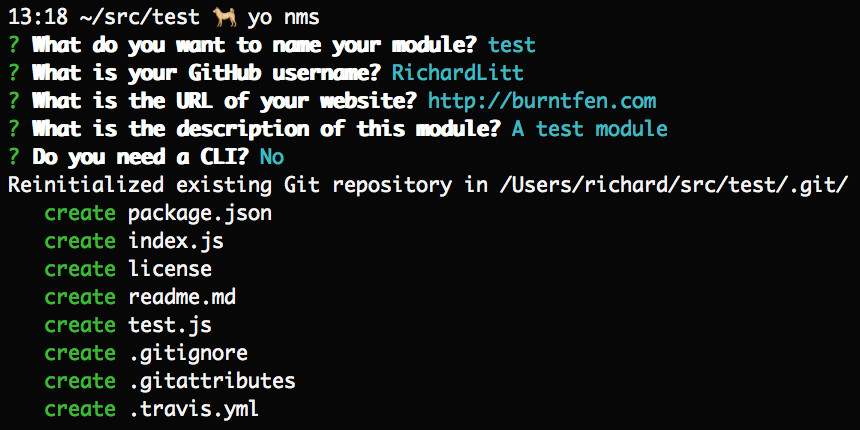

# generator-nms

[](https://greenkeeper.io/)

[](https://travis-ci.org/RichardLitt/generator-nms)
[](https://github.com/RichardLitt/standard-readme)

> Scaffold out a minimal node module using standard and ava

Optionally with a [CLI](http://en.wikipedia.org/wiki/Command-line_interface).

This is what I use for [my own modules](https://www.npmjs.com/~richardlitt). It is based heavily on [sindresorhus/generator-nm](//github.com/sindresorhus/generator-nm). The differences are:

 - I use [standard](//github.com/feross/standard) instead of [xo](https://github.com/sindresorhus/xo);
 - I removed the .editorconfig file because I never use it;
 - I made the description part of the initial setup instead of using [superb](https://github.com/sindresorhus/superb);
 - I added a `lint` command to the package.json.
 - I use [standard-readme](https://github.com/RichardLitt/standard-readme).

I expect that there will be more differences in the future.




## Install

```
$ npm install --global generator-nms
```

## Usage

With [yo](https://github.com/yeoman/yo):

```
$ yo nms
```

### Travis

Note that this adds a `.travis.yml`, but doesn't enable it. To do this, I would suggest installing the [Travis CLI](https://github.com/travis-ci/travis.rb#installation), and then running `travis enable` in the repo after running `yo nms`.


## Tip

Use [chalk](https://github.com/sindresorhus/chalk) if you want colors in your CLI.

## Contribute

PRs and [issues](https://github.com/RichardLitt/generator-nms/issues) gladly accepted.

## License

MIT © [Richard Littauer](http://burntfen.com)
